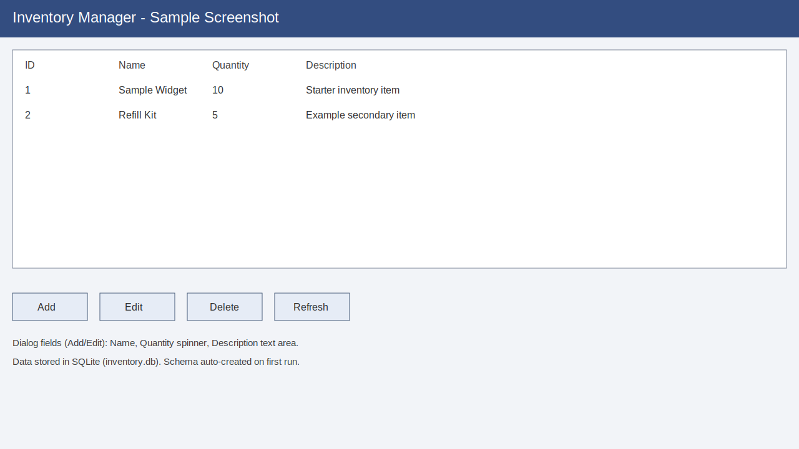

# Local Inventory App

A minimal Swing-based desktop client for tracking inventory items backed by a Postgres database.

## Prerequisites

- Java 17 or later
- Maven 3.8+ for build/run tasks
- Docker (to run Postgres locally with `docker-compose`)

## Configuration

Database configuration is read from `src/main/resources/application.properties`:

- `db.url` (default: `jdbc:postgresql://localhost:5432/inventory`): JDBC connection string for the Postgres instance.
- `db.user` / `db.password`: Credentials for the target Postgres database (default `inventory` / `inventory`).

You can spin up a compatible local database with Docker using the provided compose snippet:

```yaml
services:
  db:
    image: postgres:16
    environment:
      POSTGRES_USER: inventory
      POSTGRES_PASSWORD: inventory
      POSTGRES_DB: inventory
    ports:
      - "5432:5432"
    volumes:
      - dbdata:/var/lib/postgresql/data
volumes:
  dbdata:
```

Launch it with:

```bash
docker-compose up -d db
```

## Setup and Running

1. Clone the repository and move into the project directory.
2. Build the project:
   ```bash
   mvn clean package
   ```
3. Ensure Postgres is running (see the Docker instructions above).
4. Run the GUI:
   ```bash
   mvn exec:java
   ```
   The application launches a Swing window titled **Inventory Manager** with a table of items and Add/Edit/Delete/Refresh controls. Closing the window terminates the JVM.

### Database initialization and seed data

- On startup the app creates the `devices` table if it does not exist.
- Columns: `id` (identity primary key), `type` (text), `location` (text), `serial_number` (text, unique), `description` (text), and `redistributable` (boolean).
- No seed data is inserted automatically; your entries persist in Postgres thanks to the bound `dbdata` volume.

### Development tips

- Refresh the table with the **Refresh** button if you modify data outside the UI.
- To reset the database during local development, stop the container and remove the `dbdata` volume (`docker-compose down -v`) so Postgres starts with a clean schema.

## Screenshot

Example UI layout showing the inventory table and controls:


